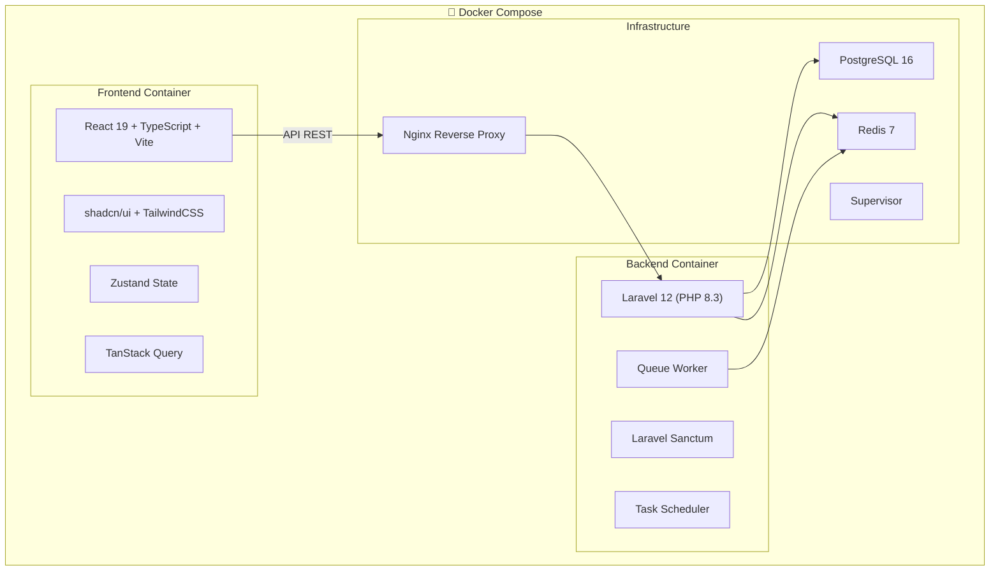
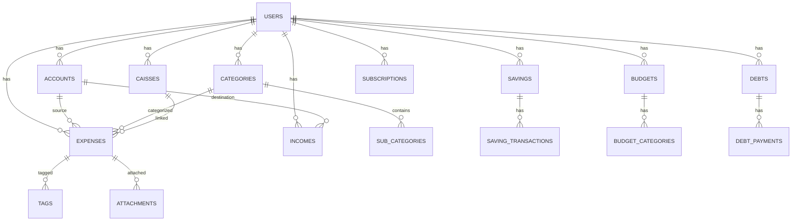

# GestDepense — Plateforme de Gestion Financière Personnelle

> Application SaaS fintech premium pour la gestion complète des finances personnelles.

## Contexte

Création d'une application fullstack moderne de gestion financière personnelle, inspirée de Linear/Stripe/Notion/Revolut, avec une architecture Laravel 12 + React 19 + TypeScript + PostgreSQL, conteneurisée avec Docker.

---

## User Review Required

> [!IMPORTANT]
> **Scope & Phasing** — Ce projet est extrêmement ambitieux (équivalent à ~6 mois de travail d'une équipe). Je propose une approche **par phases**, en livrant d'abord un MVP fonctionnel complet (Phases 1–3), puis en enrichissant progressivement. Chaque phase produit du code réellement exécutable.

> [!WARNING]
> **Services externes** — Certaines fonctionnalités (OCR reçus, IA assistant, notifications push, conversion devises temps réel) nécessitent des API tierces payantes. Je les implémenterai avec des interfaces/mocks pour les rendre facilement branchables.

> [!IMPORTANT]
> **Base de données** — Le plan utilise PostgreSQL avec UUIDs comme clé primaire. Les migrations incluront des index optimisés, mais la structure sera évolutive.

---

## Open Questions

> [!IMPORTANT]
> 1. **Nom de domaine / branding** — Le nom « GestDepense » est-il le nom final du produit, ou souhaitez-vous un autre nom (ex: « Finora », « WalletFlow ») ?
> 2. **Langue de l'UI** — Interface en français uniquement, ou anglais par défaut avec support i18n français ?
> 3. **Hébergement cible** — VPS classique (Docker Compose) ou cloud (AWS/GCP/Azure) ?
> 4. **API tierce pour les taux de change** — Préférence pour un fournisseur (ex: exchangerate-api.com, Open Exchange Rates) ?

---

## Architecture Globale



---

## Proposed Changes

### Phase 1 — Infrastructure & Fondations

> Setup Docker, Laravel, React, base de données, authentification

---

#### Docker & DevOps

##### [NEW] [docker-compose.yml](file:///Users/admin/Projets/GUINTERSE/GestDepense/docker-compose.yml)
Services : `app` (PHP-FPM 8.3), `nginx`, `postgres`, `redis`, `frontend` (Node 22), `queue-worker`, `scheduler`

##### [NEW] [docker/Dockerfile.backend](file:///Users/admin/Projets/GUINTERSE/GestDepense/docker/Dockerfile.backend)
PHP 8.3 FPM avec extensions : pgsql, redis, gd, zip, intl, bcmath

##### [NEW] [docker/Dockerfile.frontend](file:///Users/admin/Projets/GUINTERSE/GestDepense/docker/Dockerfile.frontend)
Node 22 Alpine, build multi-stage

##### [NEW] [docker/nginx/default.conf](file:///Users/admin/Projets/GUINTERSE/GestDepense/docker/nginx/default.conf)
Reverse proxy : `/api/*` → backend, `/*` → frontend

##### [NEW] [docker/supervisor/supervisord.conf](file:///Users/admin/Projets/GUINTERSE/GestDepense/docker/supervisor/supervisord.conf)
Programmes : php-fpm, queue worker, scheduler

---

#### Backend Laravel 12

##### [NEW] Structure complète Laravel

```
backend/
├── app/
│   ├── Http/
│   │   ├── Controllers/Api/V1/
│   │   │   ├── AuthController.php
│   │   │   ├── UserController.php
│   │   │   ├── AccountController.php
│   │   │   ├── ExpenseController.php
│   │   │   ├── IncomeController.php
│   │   │   ├── CategoryController.php
│   │   │   ├── CaisseController.php
│   │   │   ├── SavingController.php
│   │   │   ├── BudgetController.php
│   │   │   ├── SubscriptionController.php
│   │   │   ├── DebtController.php
│   │   │   ├── DashboardController.php
│   │   │   └── NotificationController.php
│   │   ├── Requests/
│   │   │   ├── Auth/
│   │   │   ├── Expense/
│   │   │   ├── Income/
│   │   │   ├── Account/
│   │   │   ├── Caisse/
│   │   │   ├── Saving/
│   │   │   ├── Budget/
│   │   │   ├── Subscription/
│   │   │   └── Debt/
│   │   ├── Resources/
│   │   │   ├── ExpenseResource.php
│   │   │   ├── IncomeResource.php
│   │   │   ├── AccountResource.php
│   │   │   └── ...
│   │   └── Middleware/
│   ├── Models/
│   │   ├── User.php
│   │   ├── Account.php
│   │   ├── Expense.php
│   │   ├── Income.php
│   │   ├── Category.php
│   │   ├── SubCategory.php
│   │   ├── Caisse.php
│   │   ├── Saving.php
│   │   ├── SavingTransaction.php
│   │   ├── Budget.php
│   │   ├── BudgetCategory.php
│   │   ├── Subscription.php
│   │   ├── Debt.php
│   │   ├── DebtPayment.php
│   │   ├── Tag.php
│   │   ├── Attachment.php
│   │   ├── Currency.php
│   │   ├── ExchangeRate.php
│   │   ├── AuditLog.php
│   │   └── Notification.php
│   ├── Services/
│   │   ├── AuthService.php
│   │   ├── ExpenseService.php
│   │   ├── IncomeService.php
│   │   ├── AccountService.php
│   │   ├── CaisseService.php
│   │   ├── SavingService.php
│   │   ├── BudgetService.php
│   │   ├── SubscriptionService.php
│   │   ├── DebtService.php
│   │   ├── DashboardService.php
│   │   ├── CurrencyService.php
│   │   ├── ExportService.php
│   │   ├── ImportService.php
│   │   └── AnalyticsService.php
│   ├── Repositories/
│   │   ├── Interfaces/
│   │   │   ├── ExpenseRepositoryInterface.php
│   │   │   └── ...
│   │   ├── ExpenseRepository.php
│   │   ├── IncomeRepository.php
│   │   ├── AccountRepository.php
│   │   └── ...
│   ├── DTOs/
│   │   ├── ExpenseDTO.php
│   │   ├── IncomeDTO.php
│   │   ├── AccountDTO.php
│   │   └── ...
│   ├── Policies/
│   │   ├── ExpensePolicy.php
│   │   ├── AccountPolicy.php
│   │   └── ...
│   ├── Events/
│   │   ├── ExpenseCreated.php
│   │   ├── BudgetExceeded.php
│   │   └── ...
│   ├── Listeners/
│   │   ├── UpdateAccountBalance.php
│   │   ├── CheckBudgetLimit.php
│   │   └── ...
│   ├── Jobs/
│   │   ├── ProcessRecurringExpenses.php
│   │   ├── ProcessSubscriptionPayments.php
│   │   ├── GenerateMonthlyReport.php
│   │   ├── SyncExchangeRates.php
│   │   └── ...
│   ├── Notifications/
│   │   ├── BudgetExceededNotification.php
│   │   ├── SubscriptionReminderNotification.php
│   │   ├── DebtReminderNotification.php
│   │   └── ...
│   ├── Observers/
│   │   ├── ExpenseObserver.php
│   │   ├── IncomeObserver.php
│   │   └── ...
│   ├── Traits/
│   │   ├── HasUuid.php
│   │   ├── BelongsToUser.php
│   │   ├── Filterable.php
│   │   └── ...
│   └── Helpers/
│       ├── MoneyHelper.php
│       └── DateHelper.php
├── database/
│   ├── migrations/
│   ├── seeders/
│   └── factories/
├── routes/
│   └── api.php
└── tests/
```

---

#### Base de Données — Schéma Principal



**Tables principales :**

| Table | Colonnes clés |
|-------|--------------|
| `users` | id (UUID), name, email, password, avatar, currency_code, timezone, locale, preferences (JSON), two_factor_secret, email_verified_at |
| `accounts` | id, user_id, name, type (enum), balance, currency_code, color, icon, is_active, credit_limit |
| `categories` | id, user_id, name, type (expense/income), icon, color, is_system, sort_order |
| `sub_categories` | id, category_id, name, icon |
| `expenses` | id, user_id, account_id, caisse_id, category_id, sub_category_id, title, description, amount, currency_code, date, time, payment_method, is_recurring, recurrence_rule, status, notes |
| `incomes` | id, user_id, account_id, category_id, title, amount, currency_code, date, source_type, is_recurring, recurrence_rule |
| `caisses` | id, user_id, name, budget_amount, icon, color, description |
| `savings` | id, user_id, name, target_amount, current_amount, deadline, icon, color, auto_save_amount, auto_save_frequency |
| `saving_transactions` | id, saving_id, type (deposit/withdrawal), amount, date, note |
| `budgets` | id, user_id, month, year, total_budget, notes |
| `budget_categories` | id, budget_id, category_id, allocated_amount |
| `subscriptions` | id, user_id, account_id, name, amount, currency_code, billing_cycle, next_billing_date, icon, color, is_active, reminder_days_before |
| `debts` | id, user_id, type (lent/borrowed), person_name, amount, remaining_amount, due_date, description, status |
| `debt_payments` | id, debt_id, amount, date, note |
| `tags` | id, user_id, name, color |
| `attachments` | id, attachable_type, attachable_id, file_path, file_name, file_size, mime_type |
| `currencies` | code, name, symbol, decimal_places |
| `exchange_rates` | id, from_currency, to_currency, rate, fetched_at |
| `audit_logs` | id, user_id, action, auditable_type, auditable_id, old_values, new_values, ip_address |
| `notifications` | id, user_id, type, title, body, data, read_at |

---

### Phase 2 — Frontend Foundation & Design System

> Mise en place du projet React, design system, layouts, navigation

---

#### Frontend React 19 + TypeScript

##### [NEW] Structure complète Frontend

```
frontend/
├── src/
│   ├── components/
│   │   ├── ui/          # shadcn/ui components
│   │   ├── layout/
│   │   │   ├── AppLayout.tsx
│   │   │   ├── Sidebar.tsx
│   │   │   ├── Header.tsx
│   │   │   ├── MobileNav.tsx
│   │   │   └── PageContainer.tsx
│   │   ├── dashboard/
│   │   │   ├── StatCard.tsx
│   │   │   ├── SpendingChart.tsx
│   │   │   ├── IncomeVsExpenseChart.tsx
│   │   │   ├── CategoryBreakdown.tsx
│   │   │   ├── RecentTransactions.tsx
│   │   │   ├── SavingsProgress.tsx
│   │   │   ├── BudgetOverview.tsx
│   │   │   └── QuickActions.tsx
│   │   ├── expenses/
│   │   │   ├── ExpenseList.tsx
│   │   │   ├── ExpenseForm.tsx
│   │   │   ├── ExpenseCard.tsx
│   │   │   ├── ExpenseFilters.tsx
│   │   │   └── ExpenseStats.tsx
│   │   ├── incomes/
│   │   ├── accounts/
│   │   ├── caisses/
│   │   ├── savings/
│   │   ├── budgets/
│   │   ├── subscriptions/
│   │   ├── debts/
│   │   └── common/
│   │       ├── DataTable.tsx
│   │       ├── EmptyState.tsx
│   │       ├── LoadingState.tsx
│   │       ├── MonthSelector.tsx
│   │       ├── CurrencyDisplay.tsx
│   │       ├── AmountInput.tsx
│   │       └── ConfirmDialog.tsx
│   ├── pages/
│   │   ├── auth/
│   │   │   ├── LoginPage.tsx
│   │   │   ├── RegisterPage.tsx
│   │   │   ├── ForgotPasswordPage.tsx
│   │   │   └── VerifyEmailPage.tsx
│   │   ├── DashboardPage.tsx
│   │   ├── ExpensesPage.tsx
│   │   ├── IncomesPage.tsx
│   │   ├── AccountsPage.tsx
│   │   ├── CaissesPage.tsx
│   │   ├── SavingsPage.tsx
│   │   ├── BudgetsPage.tsx
│   │   ├── SubscriptionsPage.tsx
│   │   ├── DebtsPage.tsx
│   │   ├── AnalyticsPage.tsx
│   │   ├── SettingsPage.tsx
│   │   └── NotFoundPage.tsx
│   ├── hooks/
│   │   ├── useAuth.ts
│   │   ├── useExpenses.ts
│   │   ├── useIncomes.ts
│   │   ├── useAccounts.ts
│   │   ├── useCaisses.ts
│   │   ├── useSavings.ts
│   │   ├── useBudgets.ts
│   │   ├── useSubscriptions.ts
│   │   ├── useDebts.ts
│   │   ├── useDashboard.ts
│   │   ├── useMonthNavigation.ts
│   │   └── useCurrency.ts
│   ├── stores/
│   │   ├── authStore.ts
│   │   ├── uiStore.ts
│   │   ├── monthStore.ts
│   │   └── filterStore.ts
│   ├── services/
│   │   ├── api.ts          # Axios instance
│   │   ├── authService.ts
│   │   ├── expenseService.ts
│   │   ├── incomeService.ts
│   │   ├── accountService.ts
│   │   ├── caisseService.ts
│   │   ├── savingService.ts
│   │   ├── budgetService.ts
│   │   ├── subscriptionService.ts
│   │   ├── debtService.ts
│   │   └── dashboardService.ts
│   ├── types/
│   │   ├── auth.ts
│   │   ├── expense.ts
│   │   ├── income.ts
│   │   ├── account.ts
│   │   ├── caisse.ts
│   │   ├── saving.ts
│   │   ├── budget.ts
│   │   ├── subscription.ts
│   │   ├── debt.ts
│   │   ├── common.ts
│   │   └── api.ts
│   ├── lib/
│   │   ├── utils.ts
│   │   ├── formatters.ts
│   │   ├── validators.ts
│   │   └── constants.ts
│   ├── styles/
│   │   └── globals.css
│   ├── App.tsx
│   ├── Router.tsx
│   └── main.tsx
├── public/
│   ├── manifest.json     # PWA
│   └── sw.js             # Service Worker
├── index.html
├── vite.config.ts
├── tailwind.config.ts
├── tsconfig.json
└── package.json
```

---

### Phase 3 — Modules Métier Core

> Implémentation complète de : Dépenses, Revenus, Comptes, Catégories

#### Backend — Controllers, Services, Repositories

##### [NEW] [backend/app/Http/Controllers/Api/V1/ExpenseController.php](file:///Users/admin/Projets/GUINTERSE/GestDepense/backend/app/Http/Controllers/Api/V1/ExpenseController.php)
CRUD complet, filtres avancés (date, catégorie, compte, caisse, montant min/max, recherche), pagination, export

##### [NEW] [backend/app/Services/ExpenseService.php](file:///Users/admin/Projets/GUINTERSE/GestDepense/backend/app/Services/ExpenseService.php)
Logique métier : création avec mise à jour du solde, récurrence, catégorisation auto, calculs

##### [NEW] [backend/app/Repositories/ExpenseRepository.php](file:///Users/admin/Projets/GUINTERSE/GestDepense/backend/app/Repositories/ExpenseRepository.php)
Requêtes optimisées avec eager loading, scopes, agrégations

#### Frontend — Pages & Components

##### [NEW] Pages complètes pour chaque module
- Listes avec filtres, tri, recherche temps réel
- Formulaires avec validation Zod
- Cartes visuelles avec animations Framer Motion
- Graphiques Recharts intégrés

---

### Phase 4 — Caisses, Épargnes, Budgets

> Système de caisses personnalisées, objectifs d'épargne avec progression, budgets mensuels

#### Logique métier

- **Caisses** : Budget alloué, dépenses liées, alertes seuil, stats
- **Épargnes** : Objectifs avec barre de progression, versements/retraits, automatisation (Job)
- **Budgets** : Vue centrée sur le mois, allocation par catégorie, surplus/déficit, comparaison mois précédent

---

### Phase 5 — Abonnements, Dettes, Notifications, Dashboard

> Modules secondaires et dashboard analytique complet

#### Dashboard

- **Widgets** : Total dépensé/gagné, cash disponible, épargne totale, burn rate
- **Graphiques** : Courbes mensuelles (area chart), dépenses par catégorie (donut), budget vs réel (bar chart), heatmap activité
- **KPIs** : Taux d'épargne, dépenses moyennes/jour, prévision fin de mois, scoring financier

#### Notifications

- Jobs Laravel planifiés via Scheduler
- Notifications in-app temps réel
- Résumés hebdomadaires/mensuels

---

### Phase 6 — Analytics, IA, Export, PWA, Polish

> Fonctionnalités avancées et finitions

#### Analytics avancés
- Tendances financières sur 6/12 mois
- Détection de dépenses inhabituelles (écart-type)
- Prédictions budgétaires (moyenne mobile)
- Scoring financier personnel

#### Import/Export
- Export PDF (avec graphiques), Excel, CSV, JSON
- Import CSV intelligent avec mapping colonnes

#### PWA
- Service Worker pour mode offline
- Manifest avec icônes
- Cache stratégique

#### IA / Smart Features
- Catégorisation automatique (basée sur l'historique)
- Suggestions d'économie
- Interface pour brancher un LLM (assistant financier)

---

## API Design

### Endpoints principaux (v1)

| Method | Endpoint | Description |
|--------|----------|-------------|
| `POST` | `/api/v1/auth/register` | Inscription |
| `POST` | `/api/v1/auth/login` | Connexion |
| `POST` | `/api/v1/auth/logout` | Déconnexion |
| `POST` | `/api/v1/auth/forgot-password` | Mot de passe oublié |
| `POST` | `/api/v1/auth/reset-password` | Réinitialisation |
| `GET` | `/api/v1/auth/user` | Profil connecté |
| `PUT` | `/api/v1/auth/user` | Mise à jour profil |
| | | |
| `GET` | `/api/v1/accounts` | Liste comptes |
| `POST` | `/api/v1/accounts` | Créer compte |
| `GET` | `/api/v1/accounts/{id}` | Détail compte |
| `PUT` | `/api/v1/accounts/{id}` | Modifier compte |
| `DELETE` | `/api/v1/accounts/{id}` | Supprimer compte |
| | | |
| `GET` | `/api/v1/expenses` | Liste dépenses (filtrable) |
| `POST` | `/api/v1/expenses` | Créer dépense |
| `GET` | `/api/v1/expenses/{id}` | Détail dépense |
| `PUT` | `/api/v1/expenses/{id}` | Modifier dépense |
| `DELETE` | `/api/v1/expenses/{id}` | Supprimer dépense |
| `GET` | `/api/v1/expenses/export` | Export dépenses |
| | | |
| `GET` | `/api/v1/incomes` | Liste revenus |
| `POST` | `/api/v1/incomes` | Créer revenu |
| `PUT` | `/api/v1/incomes/{id}` | Modifier revenu |
| `DELETE` | `/api/v1/incomes/{id}` | Supprimer revenu |
| | | |
| `GET` | `/api/v1/categories` | Catégories |
| `POST` | `/api/v1/categories` | Créer catégorie |
| | | |
| `GET` | `/api/v1/caisses` | Liste caisses |
| `POST` | `/api/v1/caisses` | Créer caisse |
| `GET` | `/api/v1/caisses/{id}/stats` | Stats caisse |
| | | |
| `GET` | `/api/v1/savings` | Objectifs épargne |
| `POST` | `/api/v1/savings` | Créer objectif |
| `POST` | `/api/v1/savings/{id}/deposit` | Versement |
| `POST` | `/api/v1/savings/{id}/withdraw` | Retrait |
| | | |
| `GET` | `/api/v1/budgets` | Budgets (par mois) |
| `POST` | `/api/v1/budgets` | Créer/MAJ budget mensuel |
| `GET` | `/api/v1/budgets/{month}/{year}` | Budget du mois |
| | | |
| `GET` | `/api/v1/subscriptions` | Abonnements |
| `POST` | `/api/v1/subscriptions` | Créer abonnement |
| | | |
| `GET` | `/api/v1/debts` | Dettes/créances |
| `POST` | `/api/v1/debts` | Créer dette |
| `POST` | `/api/v1/debts/{id}/payment` | Remboursement |
| | | |
| `GET` | `/api/v1/dashboard` | Données dashboard |
| `GET` | `/api/v1/dashboard/monthly-summary` | Résumé mensuel |
| `GET` | `/api/v1/dashboard/trends` | Tendances |
| `GET` | `/api/v1/dashboard/category-breakdown` | Répartition catégories |
| | | |
| `GET` | `/api/v1/notifications` | Notifications |
| `PUT` | `/api/v1/notifications/{id}/read` | Marquer comme lu |

---

## Design System

### Palette de couleurs

```
Primary:    HSL(230, 80%, 60%)  → Bleu royal profond
Secondary:  HSL(160, 70%, 50%)  → Vert émeraude (argent/succès)
Accent:     HSL(270, 70%, 60%)  → Violet premium
Warning:    HSL(35, 90%, 55%)   → Ambre
Danger:     HSL(0, 75%, 55%)    → Rouge corail
Success:    HSL(145, 65%, 45%)  → Vert

Dark Mode BG:    HSL(230, 25%, 8%)
Dark Mode Card:  HSL(230, 20%, 12%)
Dark Mode Border: HSL(230, 15%, 18%)

Light Mode BG:    HSL(220, 20%, 97%)
Light Mode Card:  HSL(0, 0%, 100%)
```

### Typographie
- **Font** : Inter (Google Fonts)
- **Headings** : Inter 600/700
- **Body** : Inter 400/500

### Animations (Framer Motion)
- Page transitions : fade + slide
- Card hover : scale(1.02) + shadow
- Number counters : spring animation
- Charts : staggered entrance
- Modals : scale + opacity

---

## Verification Plan

### Automated Tests

**Backend (PHPUnit/Pest) :**
```bash
# Tests unitaires services
php artisan test --filter=ExpenseServiceTest
php artisan test --filter=AccountServiceTest

# Tests feature API
php artisan test --filter=ExpenseApiTest
php artisan test --filter=AuthApiTest

# Tous les tests
php artisan test
```

**Frontend (Vitest) :**
```bash
npm run test
```

**Docker :**
```bash
docker compose up -d
docker compose exec app php artisan migrate --seed
# Vérifier http://localhost:3000 (frontend)
# Vérifier http://localhost:8000/api/v1 (backend)
```

### Manual Verification
- Tester le flow complet : inscription → création compte → ajout dépense → visualisation dashboard
- Vérifier le responsive (mobile/tablet/desktop)
- Vérifier dark/light mode
- Tester les filtres et la recherche
- Vérifier les graphiques avec données réelles (seeders)
